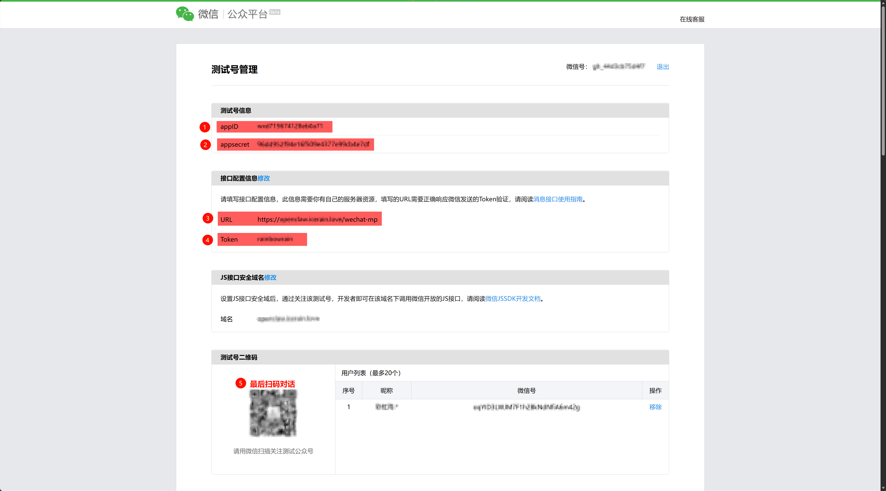
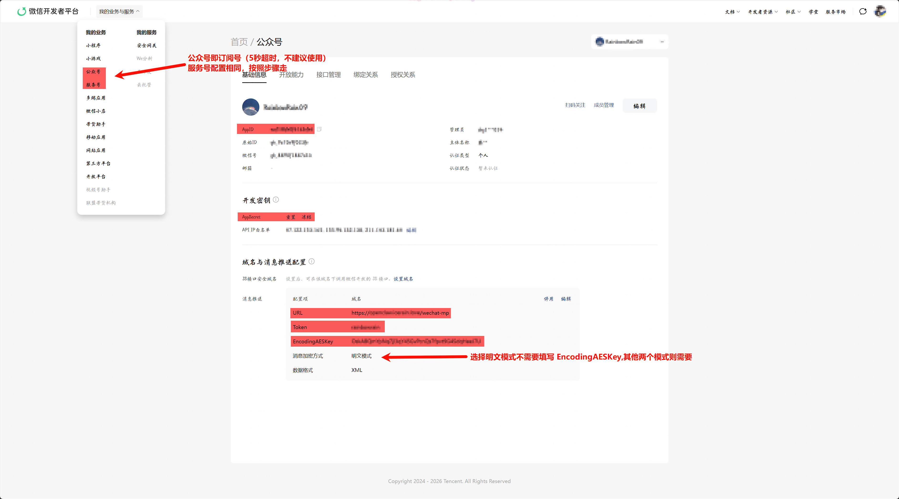
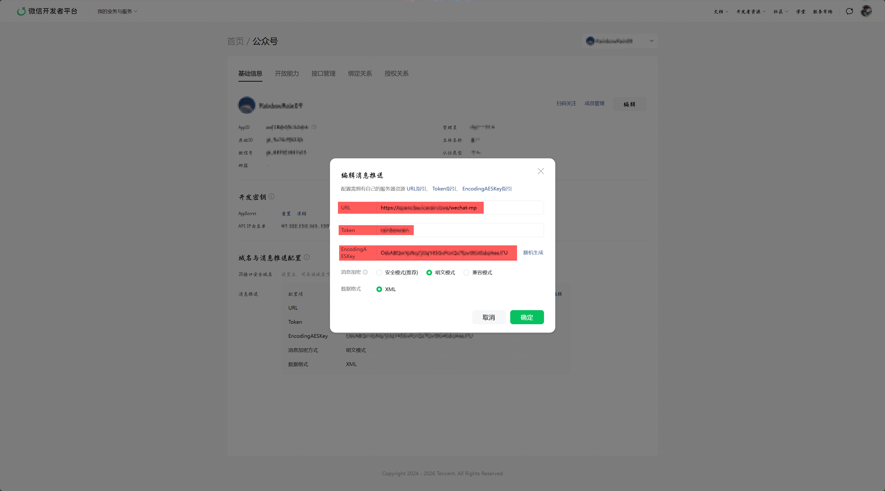
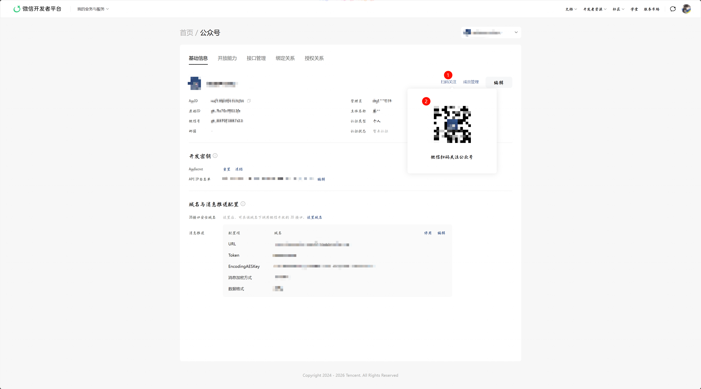

# 微信公众号（WeChat MP）配置指南

## 使用场景

<table>
  <tr>
    <th>在公众号私信接收信息</th>
    <th>在个人微信界面对话</th>
  </tr>
  <tr>
    <td></td>
    <td></td>
  </tr>
  <tr>
    <th>可分享</th>
    <th>可添加桌面一键打开</th>
  </tr>
  <tr>
    <td></td>
    <td></td>
  </tr>
</table>

本文档用于配置 OpenClaw China 的微信公众号渠道（`wechat-mp`）。

> 当前文档只覆盖 **P0 已实现能力**。
>
> 已实现：
>
> - 单账号配置
> - `GET` / `POST` 回调接入
> - `plain / safe / compat` 三种消息模式基础支持
> - `access_token` 获取、缓存、刷新
> - 文本消息入站
> - 基础事件（`subscribe / unsubscribe / scan / click / view`）
> - OpenClaw routing / session / reply 主链路接入
> - 被动回复（passive reply）主路径
> - 主动发送（active outbound）基础 skeleton
>
> 暂未完整承诺：
>
> - 全量媒体消息收发
> - OAuth / JS-SDK / 菜单 / 二维码 / 模板消息全量能力
> - 完整多账号交互式 setup

---

## 最短接入步骤

1. 安装聚合包或单独安装 `wechat-mp` 插件。
2. 运行 `openclaw china setup`，选择 **WeChat MP（微信公众号）**。
3. 在公众号后台填写服务器地址（你的公网网关地址 + `webhookPath`）。
4. 先用 `plain` 或 `safe` 模式完成最小联调。
5. 启动网关，向公众号发送一条文本消息，确认能收到回复。

---

## 一、前置条件

在开始前，请确保具备以下条件：

1. 一个已开通开发者模式的微信公众号（订阅号或服务号）。
   1. 订阅号受到**5秒回复限**制，且**不支持主动发送消息**；服务号没有回复限制，且支持主动发送消息。
   2. 故不建议使用订阅号，可选择 **测试号**（拥有服务号权限）或正式**认证服务号**。
2. 一台能被公网访问的机器，用于运行 OpenClaw Gateway。
3. 一个**域名**（或使用内网穿透工具）指向你的机器，以便公众号服务器能访问到你的回调地址。
   > 注意⚠️：仅支持 80 或者 443 端口。你可能需要购买域名，然后反向代理流量到 openclaw 所在服务器的 18789 端口（默认端口），或者将端口改成 80 端口（注意服务器需要没有软件在占用 80 端口）。
   >
4. 已安装 OpenClaw。
5. 已安装 Node.js 与 pnpm（如果你从源码安装插件）。

---

## 二、安装插件

### 方式一：安装聚合包（推荐）

```bash
openclaw plugins install @openclaw-china/channels
openclaw china setup
openclaw config set gateway.bind lan
```

### 方式二：只安装 wechat-mp 插件

```bash
openclaw plugins install @openclaw-china/wechat-mp
openclaw china setup
openclaw config set gateway.bind lan
```

### 方式三：从源码安装（适合开发调试 / Windows 兼容）

```bash
git clone https://github.com/BytePioneer-AI/openclaw-china.git
cd openclaw-china
pnpm install
pnpm build
openclaw plugins install -l ./packages/channels
openclaw china setup
openclaw config set gateway.bind lan
```

---

## 三、订阅号 / 服务号 / 测试号怎么选

|                        | 订阅号                                     | 服务号                      | 测试号                                                                              |
| ---------------------- | ------------------------------------------ | --------------------------- | ----------------------------------------------------------------------------------- |
| **适合场景**     | 个人开发者、内容推送                       | 企业正式运营                | 开发调试、快速验证                                                                  |
| **回复限制**     | 5 秒内必须回复，否则用户看到"服务出现故障" | 无时间限制                  | 无时间限制（拥有服务号权限）                                                        |
| **主动发送**     | ❌ 不支持                                  | ✅ 客服消息接口             | ✅ 客服消息接口                                                                     |
| **推荐回复模式** | `passive`                                | `active`                  | `active`                                                                          |
| **获取方式**     | 微信公众平台注册                           | 微信公众平台注册 + 企业认证 | [测试号申请](https://mp.weixin.qq.com/debug/cgi-bin/sandbox?t=sandbox/login)，扫码即用 |
| **需要公网 IP**  | ✅                                         | ✅                          | ✅                                                                                  |
| **端口要求**     | 仅 80 / 443                                | 仅 80 / 443                 | 仅 80 / 443                                                                         |

**推荐**：如果没有企业认证服务号，建议先用**测试号**跑通最小闭环。测试号拥有与服务号相同的高级接口权限（包括客服消息主动发送），扫码即可申请，无需任何认证。正式上线后再切换到认证服务号。

**为什么建议先用测试号**

- 无需企业认证，扫码即可使用
- 拥有服务号级别的高级接口权限
- 可以体验 `active` 主动发送模式
- 适合开发调试和功能验证
- 唯一限制：仅用于测试，无法面向真实用户发布

**关于订阅号的限制**

- 订阅号必须在 **5 秒内** 完成被动回复，否则微信会向用户展示"该公众号提供的服务出现故障"
- 订阅号**不支持**客服消息接口，因此无法使用 `active` 模式
- 如果你只有订阅号，需要确保 OpenClaw 能在 5 秒内生成回复；对于复杂或耗时较长的回复，建议使用服务号或测试号的 `active` 模式

---

## 四、在公众号后台准备参数

你至少需要下面这些字段：

```json
{
  "webhookPath": "/wechat-mp",
  "appId": "wx1234567890abcdef",
  "appSecret": "your-app-secret",
  "token": "your-callback-token",
  "encodingAESKey": "your-43-char-encoding-aes-key",
  "messageMode": "safe",
  "replyMode": "active",
  "activeDeliveryMode": "split"
}
```

### 字段来源

- `appId`：公众号后台可见
- `appSecret`：公众号后台开发配置可见
- `token`：你自己设置，需与公众号后台保持一致
- `encodingAESKey`：你自己设置，长度为 43 字符；仅 `safe / compat` 需要
- `webhookPath`：你自己决定，例如 `/wechat-mp`
- `activeDeliveryMode`：仅 `replyMode=active` 时生效，`split` 表示逐条发送日志/chunk，`merged` 表示最终合并成一条主动消息

## 五、配置步骤

### 测试号

访问地址：[微信公众平台接口测试帐号申请](https://mp.weixin.qq.com/debug/cgi-bin/sandbox?t=sandbox/login)

> 无需公众帐号、快速申请接口测试号；直接体验和测试公众平台所有高级接口



1. 扫码登录
2. 填写

```bash
  openclaw config set channels.wechat-mp.enabled true
  openclaw config set channels.wechat-mp.webhookPath /wechat-mp
  openclaw config set channels.wechat-mp.appId wx1234567890abcdef
  openclaw config set channels.wechat-mp.token your-callback-token
  openclaw config set channels.wechat-mp.messageMode plain
  openclaw config set channels.wechat-mp.replyMode active
  openclaw config set channels.wechat-mp.activeDeliveryMode split
  openclaw config set gateway.controlUi.allowedOrigins --json '["https://your.domain.com"]'
```

3. 启动gateway

```bash
  openclaw gateway --port 18789 --verbose
```

4. 在测试号后台填写服务器配置

- URL：`https://your.domain.com/wechat-mp`
- Token：与你配置里的 `channels.wechat-mp.token` 一致
- 提交

5. 扫码关注测试号，向公众号发送一条文本消息，确认能收到回复。

### 订阅号/服务号

访问地址：[微信开发者平台](https://developers.weixin.qq.com/platform)
扫码进入，选择公众号(订阅号)/服务号(有**企业认证服务号**就选服务号那栏， 别选到公众号缺少功能)




1. 先填写

```bash
  openclaw config set channels.wechat-mp.enabled true
  openclaw config set channels.wechat-mp.webhookPath /wechat-mp
  openclaw config set channels.wechat-mp.appId wx1234567890abcdef
  openclaw config set channels.wechat-mp.token your-callback-token
  openclaw config set channels.wechat-mp.messageMode plain
  openclaw config set channels.wechat-mp.replyMode passive
  openclaw config set gateway.controlUi.allowedOrigins --json '["https://your.domain.com"]'
```

> `activeDeliveryMode` 只在 `replyMode=active` 时生效；订阅号使用 `passive` 时无需配置。

  注意⚠️：域名必须指向运行 OpenClaw Gateway 的服务器端口，并且需要配置 `gateway.controlUi.allowedOrigins` 以允许 Control UI 从公众号后台访问。

2. 启动gateway

```bash
  openclaw gateway --port 18789 --verbose
```

3. 在公众号后台填写服务器配置

- URL：`https://your.domain.com/wechat-mp`
- Token：与你配置里的 `channels.wechat-mp.token` 一致
- EncodingAESKey：与你配置里的 `channels.wechat-mp.encodingAESKey` 一致（safe/compat 时)
- 消息加解密方式：选择 `明文模式`（plain）或 `安全模式`（safe）
- 点击提交，完成验证
- 如果验证失败，检查日志中的错误信息，确认公网地址和端口配置正确，并且网关正在运行。
- 扫码体验二维码，关注公众号。
    > 
- 验证成功后，向公众号发送一条文本消息，确认能收到回复。
- 如果replyMode passive，确认回复消息在5秒内返回；（订阅号必须 passive）
- 如果replyMode active，确认回复消息通过客服消息接口发送成功。（服务号推荐 active）

  > ```bash
  > openclaw config set channels.wechat-mp.replyMode active
  > ```

---

## 六、推荐配置方式：`openclaw china setup`

运行：

```bash
openclaw china setup
```

然后选择：

- `WeChat MP（微信公众号）`

向导目前会提示你填写：

- `webhookPath`
- `appId`
- `appSecret`（主动发送需要）
- `token`
- `messageMode`
- `encodingAESKey`（`safe / compat` 必填, `plain`(明文模式)不需要）
- `replyMode` (订阅号填 `passive`, 服务号选 `active`)
- `activeDeliveryMode`（仅 `active` 时有效，推荐先用 `split`）
- `welcomeText`

> 当前 setup 以 **default account** 为主。
>
> 配置 schema 已经是 **multi-account ready**，但交互式多账号配置不是当前 P0 主目标。

---

## 七、手动配置

### 1. 命令行逐项写入

#### plain 模式最小配置

```bash
openclaw config set channels.wechat-mp.enabled true
openclaw config set channels.wechat-mp.webhookPath /wechat-mp
openclaw config set channels.wechat-mp.appId wx1234567890abcdef
openclaw config set channels.wechat-mp.token your-callback-token
openclaw config set channels.wechat-mp.messageMode plain
openclaw config set channels.wechat-mp.replyMode passive
```

#### safe 模式推荐配置

```bash
openclaw config set channels.wechat-mp.enabled true
openclaw config set channels.wechat-mp.webhookPath /wechat-mp
openclaw config set channels.wechat-mp.appId wx1234567890abcdef
openclaw config set channels.wechat-mp.appSecret your-app-secret
openclaw config set channels.wechat-mp.token your-callback-token
openclaw config set channels.wechat-mp.encodingAESKey your-43-char-encoding-aes-key
openclaw config set channels.wechat-mp.messageMode safe
openclaw config set channels.wechat-mp.replyMode active
openclaw config set channels.wechat-mp.activeDeliveryMode split
openclaw config set channels.wechat-mp.welcomeText "你好，欢迎关注。"
```

### 2. 直接编辑配置文件

编辑 `~/.openclaw/openclaw.json`：

```json
{
  "channels": {
    "wechat-mp": {
      "enabled": true,
      "webhookPath": "/wechat-mp",
      "appId": "wx1234567890abcdef",
      "appSecret": "your-app-secret",
      "token": "your-callback-token",
      "encodingAESKey": "your-43-char-encoding-aes-key",
      "messageMode": "safe",
      "replyMode": "active",
      "activeDeliveryMode": "split",
      "welcomeText": "你好，欢迎关注。",
      "dmPolicy": "open",
      "allowFrom": []
    }
  }
}
```

---

## 八、配置字段说明

| 字段                   | 是否必需 | 默认值        | 说明                                                        |
| ---------------------- | -------- | ------------- | ----------------------------------------------------------- |
| `enabled`            | 建议     | `false`       | 启用渠道                                                    |
| `webhookPath`        | 建议     | `/wechat-mp`  | 回调路径                                                    |
| `appId`              | 是       | —             | 公众号 AppID                                                |
| `appSecret`          | 条件必需 | —             | 主动发送能力需要；只做被动回复时可暂不配置                  |
| `token`              | 是       | —             | 回调验签 token                                              |
| `encodingAESKey`     | 条件必需 | —             | `safe / compat` 模式必需；`plain` 模式可省略            |
| `messageMode`        | 建议     | —             | `plain` / `safe` / `compat`；setup 向导默认 `safe`       |
| `replyMode`          | 建议     | `passive`     | `passive` / `active`                                     |
| `activeDeliveryMode` | 否       | `split`       | 仅 `active` 生效：`split` 逐条发送，`merged` 合并发送 |
| `welcomeText`        | 否       | —             | 欢迎语 / 默认提示文案                                       |
| `dmPolicy`           | 否       | —             | `open / pairing / allowlist / disabled`                   |
| `allowFrom`          | 否       | —             | allowlist 模式下允许的发送者列表                            |
| `defaultAccount`     | 否       | `default`     | 多账号默认账号                                              |
| `accounts`           | 否       | —             | 多账号 schema 预留                                          |

---

## 九、消息模式说明

### 1. `plain`

- 微信推送明文消息体
- `GET` 验证使用 `signature`
- `POST` 明文消息也校验 `signature`
- 最适合先做最小链路联调

### 2. `safe`

- 微信推送密文消息体
- `GET` 验证时需要解密 `echostr`
- `POST` 使用 `msg_signature`
- 被动回复也需要加密回包
- 推荐正式环境使用

### 3. `compat`

- 兼容模式
- 当前实现按“密文优先”边界处理
- 适合从 `plain` 迁移到 `safe` 的过渡阶段

---

## 十、回复模式说明

### 1. `passive`

- 在微信要求的 5 秒窗口内直接回包
- 当前 P0 主路径就是这个模式
- 如果 runtime 有最终文本输出，会优先返回 passive reply XML

### 2. `active`

- 走公众号客服消息 API
- 依赖 `appSecret`
- 更适合后续扩展定时任务、主动通知、运营消息等场景
- 可通过 `activeDeliveryMode` 控制主动发送形态：
  - `split`：reply pipeline 每个非空 chunk / 日志单独发送
  - `merged`：等待 reply pipeline 完成后合并为一条消息发送

### 3. `activeDeliveryMode`

- 默认值：`split`
- 仅 `replyMode=active` 时生效
- `replyMode=passive` 时始终单次 HTTP 回包，不启用 split

---

## 十一、启动与联调

### 启动网关

```bash
openclaw gateway --port 18789 --verbose
```

### 在公众号后台填写服务器配置

假设你的公网地址是：

```text
https://your.domain.com/wechat-mp
```

那么公众号后台里：

- URL：`https://your.domain.com/wechat-mp`
- Token：与你配置里的 `channels.wechat-mp.token` 一致
- EncodingAESKey：与你配置里的 `channels.wechat-mp.encodingAESKey` 一致（safe/compat 时）

### 最小联调顺序

1. 使用 `plain` 模式完成服务器地址验证。
2. 启动网关。
3. 向公众号发送一条文本消息。
4. 确认日志中出现 webhook ingress / dispatch / reply 相关记录。
5. 确认公众号侧收到回复。
6. 可选择再切换到 `safe` 模式验证加密链路。

---

## 十二、推荐验证命令

```bash
pnpm -F @openclaw-china/wechat-mp build
pnpm -F @openclaw-china/wechat-mp test
pnpm -F @openclaw-china/channels build
pnpm -F @openclaw-china/shared test
```

当前 wechat-mp 已覆盖的测试重点包括：

- GET plain 验证
- POST safe-mode 文本消息
- duplicate msgid suppression
- passive reply XML 返回
- dispatch / route / session 主链路
- token 获取 / 缓存 / refresh
- crypto 签名 / 加解密 / XML 工具
- china setup wechat-mp 分支

---

## 十三、当前已实现 / 未实现边界

### 已实现（P0）

- 单账号配置
- 回调 GET/POST 链路
- `plain / safe / compat` 基础边界
- token / crypto / XML 基础设施
- 文本消息与基础事件标准化
- routing / session / reply integration
- passive reply 主路径
- active outbound skeleton
- aggregate / setup / install hint / README / release surfaces 接线

### 暂未完整承诺（P1/P2）

- 图片、语音、视频等全量媒体收发
- OAuth / JS-SDK
- 自定义菜单与二维码
- 模板消息全量业务能力
- 完整多账号交互式 setup
- 更完整的主动发送运营能力

---

## 十四、文档入口

- 开发计划：`doc/guides/wechat-mp/doc/开发计划.md`
- 单插件 README：`extensions/wechat-mp/README.md`
- 统一项目 README：`README.md`

如果你只是想先跑通最小闭环，建议按下面的顺序：

1. 安装 `@openclaw-china/channels`
2. 执行 `openclaw china setup`
3. 先用 `plain + passive`
4. 跑通后再切到 `safe`
5. 服务号最好选择 `active`，以获取更完整的能力体验
